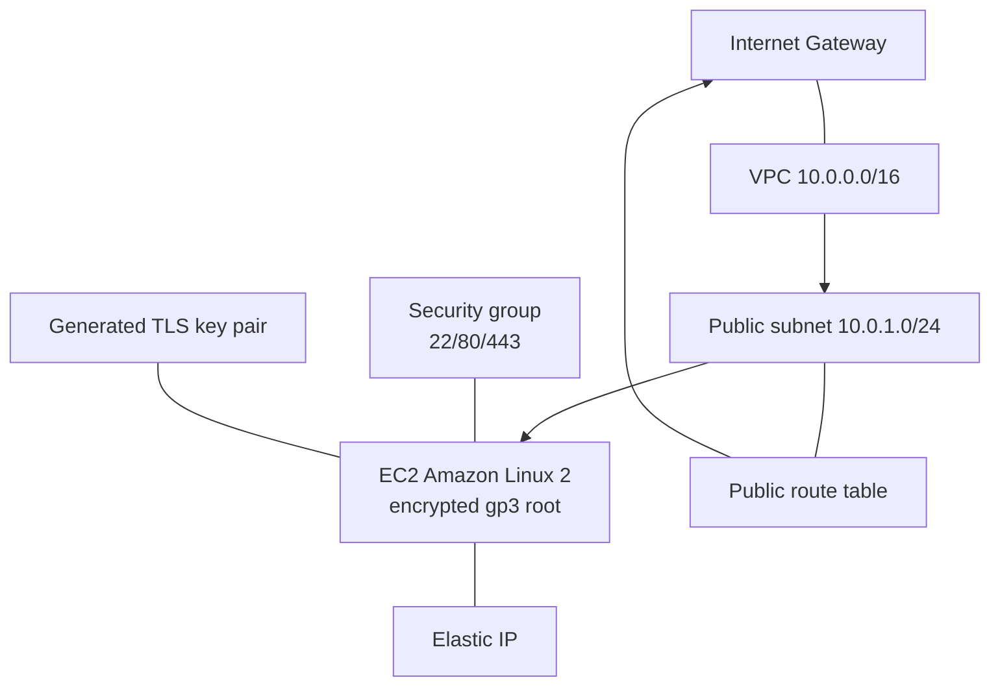

# aws-ec2-terraform

Terraform configuration that builds a self-contained AWS environment from scratch — a VPC, internet
gateway, public subnet, route table, security group, an auto-generated SSH key pair, and an EC2
instance (latest Amazon Linux 2) with an Elastic IP and an encrypted gp3 root volume.

Unlike the other EC2 examples in this account, this one defines the networking primitives directly
(no community module) and generates its own key pair — useful for understanding what a VPC module
does under the hood.

## Architecture



## What this demonstrates

- Building VPC networking from first principles (VPC, IGW, subnet, route table, associations)
- Dynamic AMI lookup with a `data` source (latest Amazon Linux 2)
- Auto-generated SSH key pair via the `tls` provider, saved locally with `0400` permissions
- Encrypted root volume and an Elastic IP
- Helpful outputs, including a ready-to-use `ssh_command`

## Prerequisites

- [Terraform](https://developer.hashicorp.com/terraform/downloads) >= 1.0
- AWS credentials configured
- Providers used: `aws`, `tls`, `local` (installed automatically by `terraform init`)

## Usage

```bash
terraform init
terraform fmt -check
terraform validate
terraform plan
terraform apply
```

After apply, connect using the generated command:

```bash
terraform output -raw ssh_command
```

Tear down with `terraform destroy`.

## Key variables

| Variable | Default | Description |
|----------|---------|-------------|
| `aws_region` | `us-east-1` | AWS region |
| `availability_zone` | `us-east-1a` | AZ for the subnet |
| `instance_type` | `t3.micro` | EC2 instance type |
| `key_name` | `my-ec2-key` | Name for the generated key pair |
| `project_name` | `my-project` | Prefix for resource names |

## Outputs

`vpc_id`, `subnet_id`, `security_group_id`, `instance_id`, `instance_public_ip`,
`instance_public_dns`, `key_pair_name`, `private_key_filename`, `ssh_command`.

## Security notes

- The generated `.pem` private key is written to the working directory — it is gitignored and must
  never be committed. Treat it like any other secret.
- The security group allows 22/80/443 from `0.0.0.0/0`. Restrict SSH to known IPs for anything
  beyond a short-lived demo.

## License

MIT
